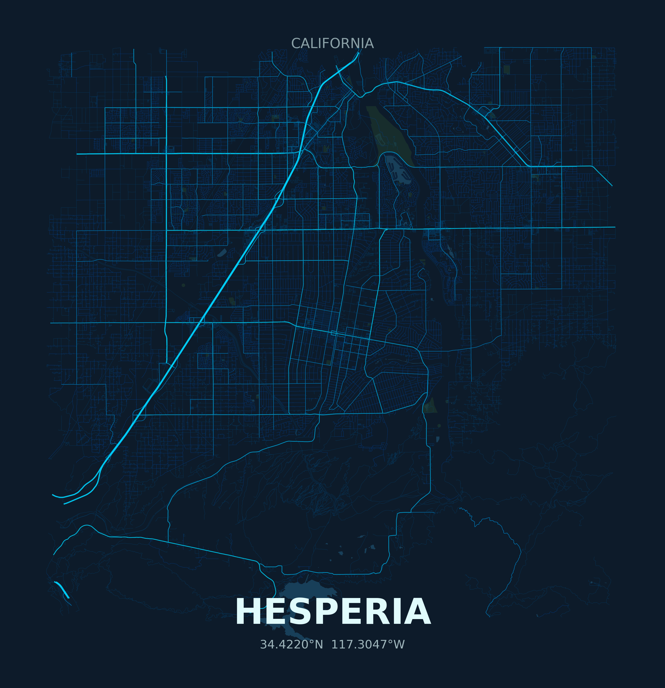

# Map Poster Generator

Generate beautiful minimalist map posters of any city with a tech-inspired dark + cyan aesthetic.

## Examples

| San Jose, CA | Hesperia, CA |
|:---:|:---:|
|  |  |

## Design

**Tech Minimalist Theme:**
- Deep navy background (#0d1b2a)
- Cyan road network (#00d4ff)
- Teal water features (#1b4965)
- Muted sage parks (#1e3a2f)
- Clean typography

The design echoes a circuit-board aesthetic while creating a striking, frameable piece of art.

## Installation

```bash
# Clone the repo
git clone https://github.com/neildharrington/map-poster.git
cd map-poster

# Create virtual environment
python -m venv venv
source venv/bin/activate  # On Windows: venv\Scripts\activate

# Install dependencies
pip install -r requirements.txt
```

## Usage

```bash
# Generate a poster for any city
python generate_poster.py "San Francisco, California, USA"

# Specify radius and resolution
python generate_poster.py "Tokyo, Japan" --radius 30 --dpi 300

# Custom labels
python generate_poster.py "NYC, USA" --label "New York" --region "New York"

# Custom output filename
python generate_poster.py "Paris, France" --output paris.png
```

## Options

| Argument | Default | Description |
|----------|---------|-------------|
| `city` | (required) | City name with state/country for accuracy |
| `--label` | auto | City name shown on poster |
| `--region` | auto | State/country shown at top |
| `--radius` | 20 | Radius in kilometers from city center |
| `--output` | `<city>_poster.png` | Output filename |
| `--dpi` | 150 | Resolution (use 300 for print quality) |
| `--no-labels` | False | Omit city name text |

## Output

Generates a high-quality PNG suitable for:
- 18x24" poster prints
- Digital wallpapers
- Framed artwork

## Tech Stack

- **OSMnx** - OpenStreetMap data retrieval
- **Matplotlib** - Rendering
- **Shapely** - Geometry handling
- **GeoPandas** - Geographic data processing

## License

MIT
